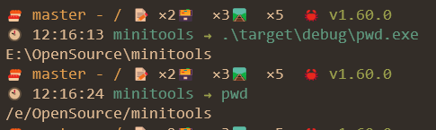

## 说明
提供一些小工具

1. ``pwd`` 等同于linux下的pwd,但是支持windows,且输出更友好


2. ``opendef`` 支持在指定目录中搜索指定扩展名的文件并使用系统默认程序打开(如果找到多个同名文件,仅打开第一个)
命令参考
```
opendef E:\OpenSource\minitools md  //表示在 E:\OpenSource\minitools 目录中搜索扩展名为 md 的文件并自动使用markdown编辑器打开
```
